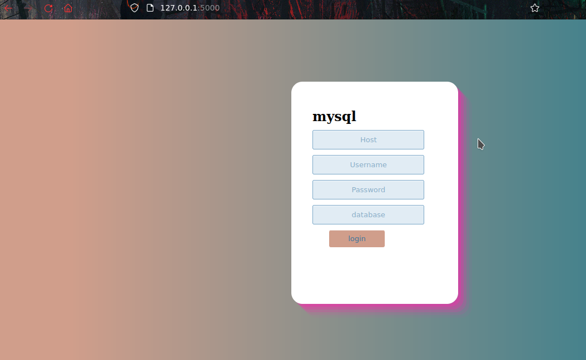
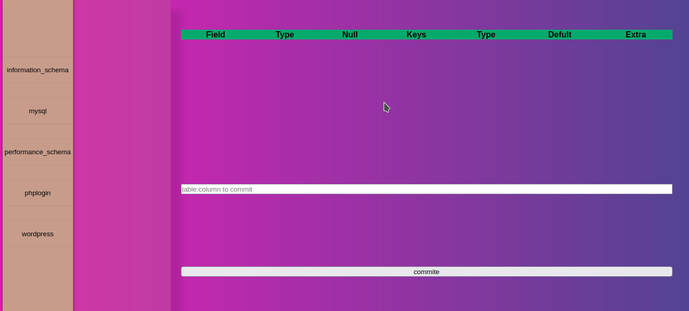
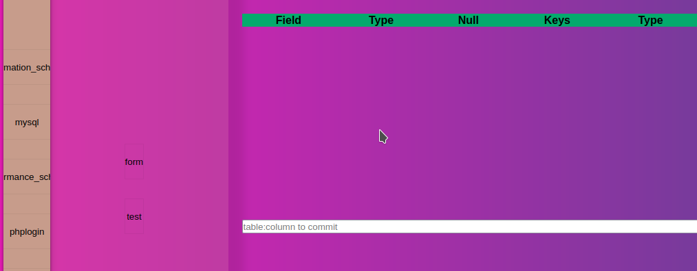
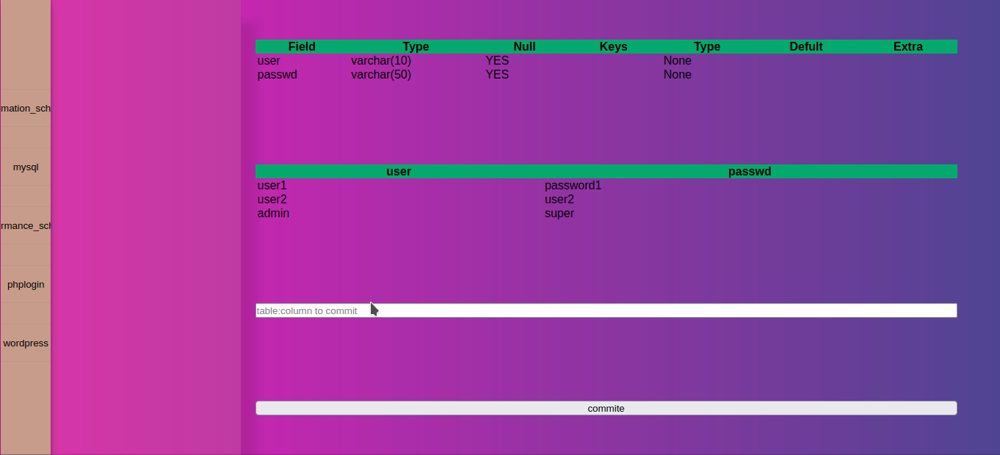
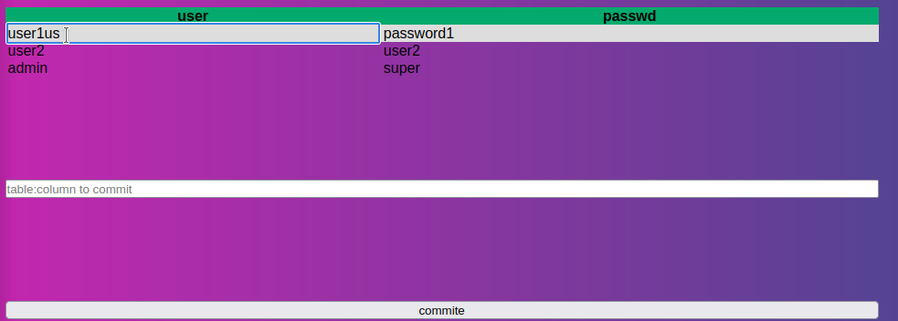

# Sqlexplore

## Helpfull program i created that used to explore and edit mysqldb; 

## After successfull login to mysql server 

## Here we can select database and table we went to get reslult

## We can even interact and edit table contents from web page

